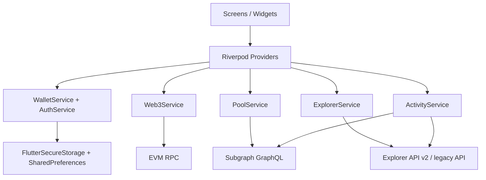

# Reef EVM Mobile App

Flutter mobile wallet for the Reef EVM ecosystem.

See also:

- [CHANGELOG.md](/Users/anukul/Desktop/reef-evm-mobile-app/CHANGELOG.md) for a release-oriented summary of shipped work

This app is built around a local-first Reef development workflow and already includes:

- multi-account wallet management
- send / receive token flows
- transaction confirmation and password signing
- pool discovery from subgraph data
- swap and liquidity flows
- activity feed from explorer + subgraph
- light mode / dark mode
- biometric protection

It is designed so the same codebase can be pointed at:

- a local Reef chain
- a staging Reef deployment
- a production Reef-compatible deployment

## What This Repo Contains

The app is not just a UI shell. It contains the wallet, Web3, explorer, and pool integrations directly in the Flutter codebase.

Core folders:

```text
lib/
  core/
    config/        DEX and chain defaults
    theme/         app-wide theming
  models/          typed wallet / pool / transaction models
  providers/       Riverpod state and service wiring
  screens/         app screens
  services/        Web3, explorer, pool, auth, storage, FCM
  utils/           shared formatting / parsing / helpers
  widgets/         reusable UI building blocks
```

## Architecture At A Glance



## Local Development

### Prerequisites

- Flutter SDK compatible with `sdk: ^3.8.1`
- Xcode for iOS builds
- Android Studio / Android SDK for Android builds
- a running Reef-compatible RPC
- Blockscout API or compatible explorer API
- a deployed subgraph for pools/activity

### Install dependencies

```bash
flutter pub get
```

### Run with local defaults

If you are using the local stack already wired into the app, this is enough:

```bash
flutter run
```

### Fresh local stack orchestration

This repo now owns the local development startup flow end to end.

From [/Users/anukul/Desktop/reef-evm-mobile-app/tool/fresh_local_stack.sh](/Users/anukul/Desktop/reef-evm-mobile-app/tool/fresh_local_stack.sh):

```bash
./tool/fresh_local_stack.sh
```

Supported targets:

```bash
./tool/fresh_local_stack.sh iphone
./tool/fresh_local_stack.sh macos
./tool/fresh_local_stack.sh chrome
```

What the script does:

- stops the previous tmux chain, graph-node stack, Blockscout stack, and generated Flutter run
- starts the detached Reef local chain from `../chain-upgrade`
- funds a fresh deployer EVM account with the local validator helper
- redeploys Reefswap contracts and seeded activity from `../reef-hardhat-example`
- rewrites `../v2-subgraph/config/localhost/*` with the fresh factory, wrapped token, and start block
- starts repo-local Docker graph-node, Postgres, and IPFS from `tool/graph-node/docker-compose.yml`
- deploys `uniswap-v2-localhost` straight to the local graph-node admin + IPFS endpoints
- prunes and restarts the Reef-local Blockscout stack from `../blockscout/docker-compose/reef-local.yml`
- writes the app runtime config to `tool/.local_stack_state.json`
- launches Flutter with `--dart-define-from-file=tool/.local_stack_state.json`

Shutdown is the inverse:

```bash
./tool/stop_local_stack.sh
```

See also [CODEX_RUNBOOK.md](/Users/anukul/Desktop/reef-evm-mobile-app/CODEX_RUNBOOK.md) for the short operator version of the same workflow.

### Generated local runtime state

The fresh-start scripts generate two local-only files:

- `tool/.local_stack_state.json`
- `tool/.local_stack_deployment.json`

Both are intentionally ignored in git and regenerated on each run.

`tool/.local_stack_state.json` is the single source of truth for the running app config and includes:

- `REEF_CHAIN_ID`
- `REEF_RPC_URL`
- `REEFSWAP_WREEF`
- `REEFSWAP_FACTORY`
- `REEFSWAP_ROUTER`
- `EXPLORER_BASE_URL`
- `EXPLORER_API_V2`
- `SUBGRAPH_GRAPHQL_ENDPOINT`
- `FORCE_RPC_FROM_ENV`
- `START_BLOCK`
- `PAIR_ADDRESS`
- `TOKEN_ADDRESS`
- `DEPLOYER_ADDRESS`
- `HOST_IP`

For `iphone`, app-facing URLs are rewritten to the Mac LAN IP so a physical device can reach them. For `macos` and `chrome`, the file stays on `127.0.0.1`.

### Run with explicit endpoints and contracts

Use `--dart-define` instead of hardcoding environment-specific values:

```bash
flutter run \
  --dart-define=REEF_CHAIN_ID=13939 \
  --dart-define=REEF_RPC_URL=http://127.0.0.1:8545 \
  --dart-define=REEFSWAP_WREEF=0xYourWreefAddress \
  --dart-define=REEFSWAP_FACTORY=0xYourFactoryAddress \
  --dart-define=REEFSWAP_ROUTER=0xYourRouterAddress \
  --dart-define=EXPLORER_BASE_URL=https://explorer.example.com \
  --dart-define=EXPLORER_API_V2=https://explorer.example.com/api/v2 \
  --dart-define=SUBGRAPH_GRAPHQL_ENDPOINT=https://subgraph.example.com/subgraphs/name/uniswap-v2 \
  --dart-define=FORCE_RPC_FROM_ENV=true
```

### Build release with production config

```bash
flutter build ios \
  --release \
  --dart-define=REEF_CHAIN_ID=13939 \
  --dart-define=REEF_RPC_URL=https://rpc.example.com \
  --dart-define=REEFSWAP_WREEF=0xYourWreefAddress \
  --dart-define=REEFSWAP_FACTORY=0xYourFactoryAddress \
  --dart-define=REEFSWAP_ROUTER=0xYourRouterAddress \
  --dart-define=EXPLORER_BASE_URL=https://explorer.example.com \
  --dart-define=EXPLORER_API_V2=https://explorer.example.com/api/v2 \
  --dart-define=SUBGRAPH_GRAPHQL_ENDPOINT=https://subgraph.example.com/subgraphs/name/uniswap-v2 \
  --dart-define=FORCE_RPC_FROM_ENV=true
```

```bash
flutter build apk \
  --release \
  --dart-define=REEF_CHAIN_ID=13939 \
  --dart-define=REEF_RPC_URL=https://rpc.example.com \
  --dart-define=REEFSWAP_WREEF=0xYourWreefAddress \
  --dart-define=REEFSWAP_FACTORY=0xYourFactoryAddress \
  --dart-define=REEFSWAP_ROUTER=0xYourRouterAddress \
  --dart-define=EXPLORER_BASE_URL=https://explorer.example.com \
  --dart-define=EXPLORER_API_V2=https://explorer.example.com/api/v2 \
  --dart-define=SUBGRAPH_GRAPHQL_ENDPOINT=https://subgraph.example.com/subgraphs/name/uniswap-v2 \
  --dart-define=FORCE_RPC_FROM_ENV=true
```

## Config Surfaces You Will Actually Change

This is the part that matters most when moving from localnet to staging or production.

### 1. DEX contract addresses and chain ID

Primary file:

- [lib/core/config/dex_config.dart](/Users/anukul/Desktop/reef-evm-mobile-app/lib/core/config/dex_config.dart)

This controls:

- wrapped REEF address
- factory address
- router address
- default chain ID
- default swap slippage / deadline

Recommended production approach:

- keep this file as a fallback only
- override with `--dart-define` during CI/CD builds

### 2. RPC endpoint

Files:

- [lib/providers/settings_provider.dart](/Users/anukul/Desktop/reef-evm-mobile-app/lib/providers/settings_provider.dart)
- [lib/services/web3_service.dart](/Users/anukul/Desktop/reef-evm-mobile-app/lib/services/web3_service.dart)

Current behavior:

- app default is `http://localhost:8545`
- users can edit the RPC in-app from Developer Settings
- `SettingsProvider` pushes the edited RPC into `Web3Service`
- `FORCE_RPC_FROM_ENV=true` now overwrites stale saved `rpc_url` preferences on startup
- the one-command local stack always launches Flutter with `--dart-define-from-file=tool/.local_stack_state.json`

For production:

- change the default RPC in both places if you do not want `localhost`
- or pre-seed the setting at first boot if you later add remote config / onboarding config
- prefer `REEF_RPC_URL` + `FORCE_RPC_FROM_ENV=true` in CI/CD so release builds cannot silently fall back to an old device-local setting

### 3. Explorer base URL and API v2 URL

Files:

- [lib/services/explorer_service.dart](/Users/anukul/Desktop/reef-evm-mobile-app/lib/services/explorer_service.dart)
- [lib/services/activity_service.dart](/Users/anukul/Desktop/reef-evm-mobile-app/lib/services/activity_service.dart)
- [lib/services/pool_service.dart](/Users/anukul/Desktop/reef-evm-mobile-app/lib/services/pool_service.dart)

These support:

- `EXPLORER_BASE_URL`
- `EXPLORER_API_V2`

Used for:

- native balance lookups
- ERC-20 balance discovery
- token catalog / token icons
- activity timeline
- explorer deep links

### 4. Subgraph endpoint

Files:

- [lib/services/pool_service.dart](/Users/anukul/Desktop/reef-evm-mobile-app/lib/services/pool_service.dart)
- [lib/services/activity_service.dart](/Users/anukul/Desktop/reef-evm-mobile-app/lib/services/activity_service.dart)

Supported define:

- `SUBGRAPH_GRAPHQL_ENDPOINT`

Used for:

- token pools page
- pair detail page
- swap route data
- liquidity and swap activity aggregation

### 5. Firebase / push notifications

Files:

- [lib/main.dart](/Users/anukul/Desktop/reef-evm-mobile-app/lib/main.dart)
- [lib/services/fcm_service.dart](/Users/anukul/Desktop/reef-evm-mobile-app/lib/services/fcm_service.dart)

Platform assets you will need in production:

- `android/app/google-services.json`
- `ios/Runner/GoogleService-Info.plist`

Right now the app is tolerant of missing Firebase config and logs a warning instead of crashing.

### 6. App name, bundle identifiers, package IDs

Files:

- [android/app/build.gradle.kts](/Users/anukul/Desktop/reef-evm-mobile-app/android/app/build.gradle.kts)
- [ios/Runner/Info.plist](/Users/anukul/Desktop/reef-evm-mobile-app/ios/Runner/Info.plist)
- [ios/Runner.xcodeproj/project.pbxproj](/Users/anukul/Desktop/reef-evm-mobile-app/ios/Runner.xcodeproj/project.pbxproj)
- [pubspec.yaml](/Users/anukul/Desktop/reef-evm-mobile-app/pubspec.yaml)

Things to update:

- Android `applicationId`
- iOS `PRODUCT_BUNDLE_IDENTIFIER`
- iOS display name
- package description / version metadata

### 7. Release signing

Files:

- [android/app/build.gradle.kts](/Users/anukul/Desktop/reef-evm-mobile-app/android/app/build.gradle.kts)

Current state:

- release builds are still using the debug signing config

Before production:

- add a proper release keystore
- define a real `signingConfigs.release`
- stop shipping builds signed with debug keys

iOS signing should be set through Xcode / Apple Developer settings for the `Runner` target.

### 8. Secure wallet storage and persistence

Files:

- [lib/services/secure_storage_service.dart](/Users/anukul/Desktop/reef-evm-mobile-app/lib/services/secure_storage_service.dart)
- [lib/constants/storage_keys.dart](/Users/anukul/Desktop/reef-evm-mobile-app/lib/constants/storage_keys.dart)

Current storage model:

- private keys and mnemonics -> `FlutterSecureStorage`
- account index / labels / settings -> `SharedPreferences`

Before production:

- treat changes to keys in `StorageKeys` as migrations
- do not rename storage keys casually
- if storage schema changes, add compatibility logic instead of breaking existing wallets

### 9. Theme / branding / assets

Files:

- [lib/core/theme/app_theme.dart](/Users/anukul/Desktop/reef-evm-mobile-app/lib/core/theme/app_theme.dart)
- [lib/core/theme/reef_theme_colors.dart](/Users/anukul/Desktop/reef-evm-mobile-app/lib/core/theme/reef_theme_colors.dart)
- [lib/core/theme/styles.dart](/Users/anukul/Desktop/reef-evm-mobile-app/lib/core/theme/styles.dart)
- `assets/images/`

Change these when you want to update:

- light / dark palettes
- gradients
- typography behavior
- icons / logos / splash visuals

### 10. Localization

Files:

- [lib/l10n/app_localizations.dart](/Users/anukul/Desktop/reef-evm-mobile-app/lib/l10n/app_localizations.dart)
- [lib/providers/locale_provider.dart](/Users/anukul/Desktop/reef-evm-mobile-app/lib/providers/locale_provider.dart)

Use these for:

- adding new languages
- changing copy globally
- setting default language behavior

## Runtime Defines Reference

Supported compile-time defines currently used by the app:

| Define | Purpose | Default |
| --- | --- | --- |
| `REEF_RPC_URL` | default RPC endpoint used by `Web3Service` | `http://localhost:8545` |
| `REEFSWAP_WREEF` | Wrapped REEF token address | local hardcoded address |
| `REEFSWAP_FACTORY` | Reefswap factory address | local hardcoded address |
| `REEFSWAP_ROUTER` | Reefswap router address | local hardcoded address |
| `REEF_CHAIN_ID` | chain ID used in transaction previews and swap config | `13939` |
| `EXPLORER_BASE_URL` | explorer base URL | `http://127.0.0.1` |
| `EXPLORER_API_V2` | explorer API v2 base URL | `http://127.0.0.1/api/v2` |
| `SUBGRAPH_GRAPHQL_ENDPOINT` | subgraph GraphQL endpoint | `http://127.0.0.1:8000/subgraphs/name/uniswap-v2-localhost` |
| `FORCE_RPC_FROM_ENV` | forces startup RPC to the compile-time `REEF_RPC_URL` instead of a saved device preference | `false` |
| `PAIR_ADDRESS` | optional local pair fallback used when subgraph is unavailable | empty |
| `TOKEN_ADDRESS` | optional local token fallback used with local pair metadata | empty |

## Production Readiness Checklist

Before shipping this app outside local development, make sure we have done all of these:

- replace all localhost defaults with real infrastructure
- provide production `--dart-define` values in CI/CD
- configure Android release signing
- configure iOS signing and provisioning
- add Firebase config files if push notifications are required
- verify explorer and subgraph are indexing the same contracts the app is using
- verify token icons are accessible from production explorer responses
- verify biometric auth on real devices
- verify transaction confirmation and signing on the production chain ID
- test account export/import flows end to end
- test native REEF sends, ERC-20 sends, approvals, swaps, and liquidity flows

## Recommended Production Setup Strategy

The cleanest approach is:

1. Keep repo defaults useful for local development.
2. Inject real production values with `--dart-define` in your release pipeline.
3. Avoid editing service files for each environment.
4. Treat `dex_config.dart` as the fallback layer, not the source of truth for production.

That keeps local development easy while avoiding “someone forgot to change localhost before release” failures.

## Local Stack Notes

This app is commonly used alongside:

- Reef local chain / EVM RPC
- Blockscout explorer
- Graph node + subgraph
- Reefswap contracts deployed through the external `reef-hardhat-example` repo

The local stack is expected to coordinate with these sibling repos:

- `../chain-upgrade`
- `../reef-hardhat-example`
- `../v2-subgraph`
- `../blockscout`

The repo-local graph-node stack itself lives here:

- [tool/graph-node/docker-compose.yml](/Users/anukul/Desktop/reef-evm-mobile-app/tool/graph-node/docker-compose.yml)

That compose file starts:

- `postgres:15-alpine`
- `ipfs/kubo:v0.30.0`
- `graphprotocol/graph-node:v0.40.0`

with graph-node configured against `http://host.docker.internal:8545` for the local chain and exposed on:

- `8000` GraphQL
- `8020` admin
- `8030`
- `8040`
- `5001` IPFS API

For Blockscout local runs, `localhost:80` must be free. If Valet or another local nginx is holding port `80`, Blockscout will not be reachable on the default local explorer URL until that service is stopped.

### App resilience for partial local stacks

The app is now more tolerant of partially booted local infrastructure:

- wallet RPC can be forced from compile-time config even if a device has a stale saved RPC preference
- pools can fall back to the fresh local on-chain pair if the subgraph is unavailable
- token USD pricing can fall back to the local pair when graph-node is down
- the selected wallet card now prefers the live active-account balance instead of a stale cached balance entry
- leaving the Create Token result screen and returning to that tab resets the tab back to the creator entry state

If pools or activity do not show up, the problem is usually one of these:

- the app points at old contract addresses
- the subgraph is indexing a different factory than the app uses
- explorer and RPC are out of sync
- the chain was restarted but the app still uses old addresses

## Troubleshooting

### App builds but balances are zero

Check:

- RPC URL in settings
- explorer API URL
- account actually funded on the current chain

### Pools page is empty

Check:

- `REEFSWAP_FACTORY`
- `SUBGRAPH_GRAPHQL_ENDPOINT`
- subgraph indexing status
- whether any pairs actually exist on-chain

### Swaps fail immediately

Check:

- router/factory/WREEF addresses
- chain ID
- RPC endpoint
- whether the current local chain was restarted without redeploying contracts

### Firebase warning appears on startup

This is expected if `google-services.json` or `GoogleService-Info.plist` is missing. The app is currently coded to continue without crashing.

## Useful Files By Responsibility

| Area | File |
| --- | --- |
| app boot | [lib/main.dart](/Users/anukul/Desktop/reef-evm-mobile-app/lib/main.dart) |
| theme | [lib/core/theme/app_theme.dart](/Users/anukul/Desktop/reef-evm-mobile-app/lib/core/theme/app_theme.dart) |
| DEX defaults | [lib/core/config/dex_config.dart](/Users/anukul/Desktop/reef-evm-mobile-app/lib/core/config/dex_config.dart) |
| wallet persistence | [lib/services/secure_storage_service.dart](/Users/anukul/Desktop/reef-evm-mobile-app/lib/services/secure_storage_service.dart) |
| auth / password / biometrics | [lib/services/auth_service.dart](/Users/anukul/Desktop/reef-evm-mobile-app/lib/services/auth_service.dart) |
| Web3 tx logic | [lib/services/web3_service.dart](/Users/anukul/Desktop/reef-evm-mobile-app/lib/services/web3_service.dart) |
| explorer integration | [lib/services/explorer_service.dart](/Users/anukul/Desktop/reef-evm-mobile-app/lib/services/explorer_service.dart) |
| pool + subgraph integration | [lib/services/pool_service.dart](/Users/anukul/Desktop/reef-evm-mobile-app/lib/services/pool_service.dart) |
| activity feed | [lib/services/activity_service.dart](/Users/anukul/Desktop/reef-evm-mobile-app/lib/services/activity_service.dart) |
| global settings | [lib/providers/settings_provider.dart](/Users/anukul/Desktop/reef-evm-mobile-app/lib/providers/settings_provider.dart) |
| localization | [lib/l10n/app_localizations.dart](/Users/anukul/Desktop/reef-evm-mobile-app/lib/l10n/app_localizations.dart) |

## Final Advice

If you are preparing a production deployment, the three most important things to keep aligned are:

1. RPC endpoint
2. DEX contract addresses
3. explorer + subgraph endpoints

If those three point at different environments, the app will still open, but balances, pools, swaps, and activity will drift or fail in confusing ways.
